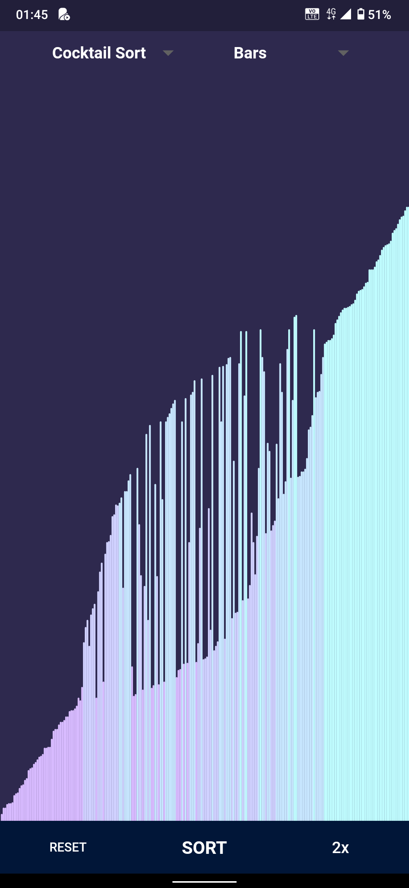
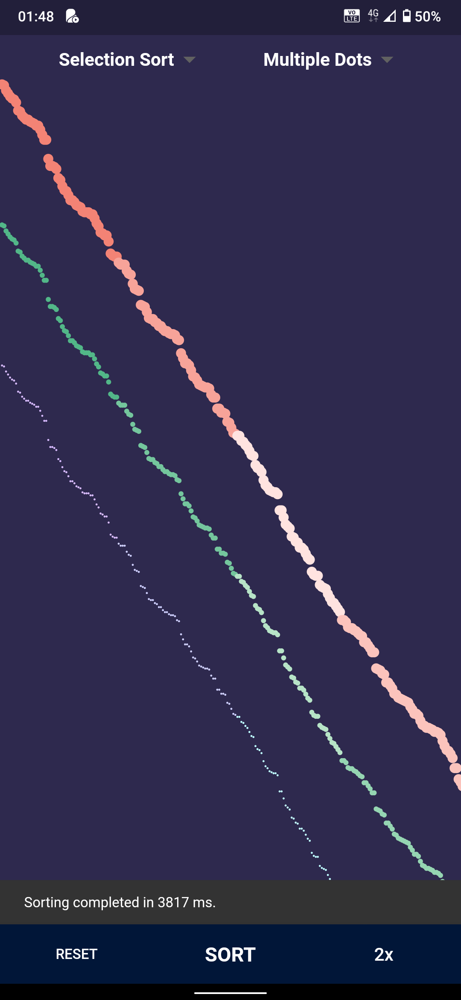
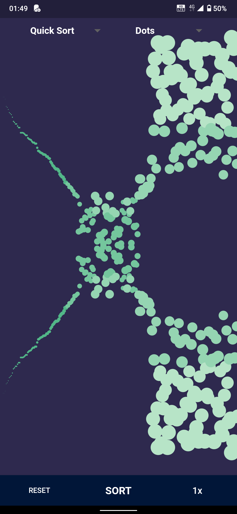
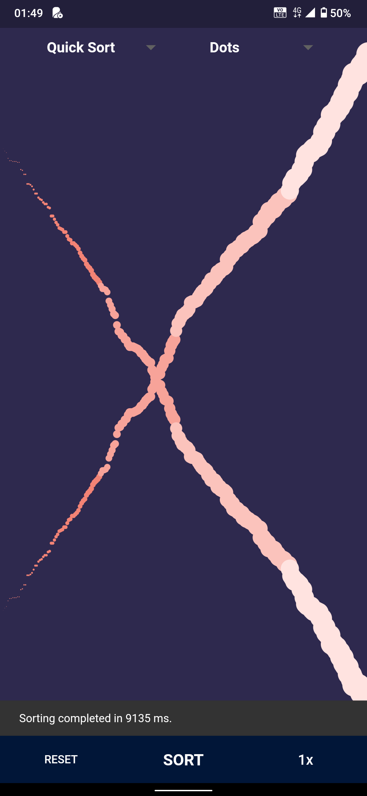

	What has been done  up until now:-
	Bubble sort working,
	Adding other algorithms will be easy as all the ground work has been set up.
	Added dropdown menu to select for bar and dots
	Different color palate added for the plot styles.
	Added all the basic sorting algorithms.
	Added a feature to sort colors.
	Added a total of 14 sorting algorithms.
    Now the play speed changes according to the algorithm you have selected.
	Added a new plot style called pyramid now making a total of 5 different ploting styles.

<!--  -->
